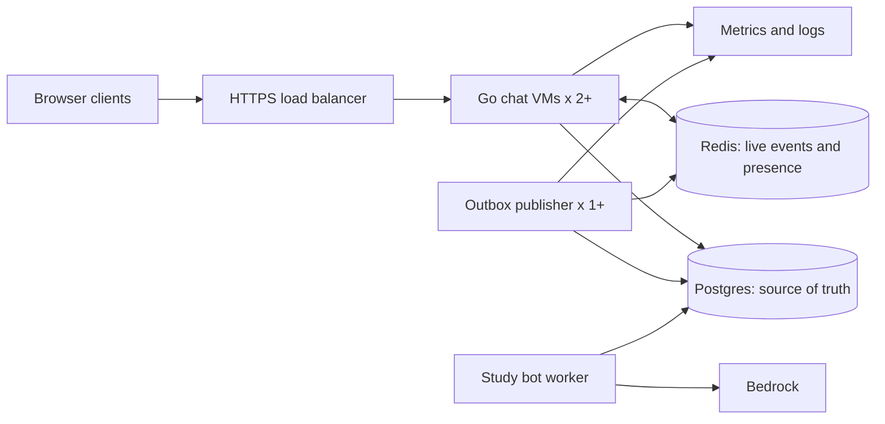

# Chattie Cloud — Distributed Systems Build Plan

Sep 27, 2026 · @Aniruddha Roy · revised Oct 1, 2026

## Goal and scope

Turn the existing single-node LAN chat application into a reliable, horizontally scaled chat system. Prove the distributed core locally, deploy it on AWS EC2 virtual machines, then deploy the **same application as a separate environment** on Azure Virtual Machines. Compute in both clouds is plain Linux VMs behind a load balancer; there is no container orchestrator (no ECS, no AKS) and no hardware or device integration.

AWS and Azure have separate users, messages, Postgres databases, and Redis instances. They are **not one cross-cloud chat network**. Cross-cloud federation is a later project requiring data ownership, replication, conflict handling, and failure semantics. Multiple app instances sharing durable storage and an event bus already form a distributed system.

**Completion target:** two or more chat VMs serve one environment; users on different VMs exchange messages; missed live events are recovered from durable history; VM restarts and replacements do not lose committed messages; authorization holds on every API and WebSocket action. Automated integration and failure tests demonstrate each claim.

## Starting point

The Go app already has storage interfaces, SQLite, a local WebSocket hub, REST endpoints, and a web client. The cloud version replaces the single-host SQLite deployment: Postgres becomes the only supported store, and SQLite compatibility is not maintained after gate 1. These are migration tasks, not features the current app provides:

- `cmd/chattie/main.go` opens SQLite and starts one in-memory hub. Replace SQLite and its checkpoint work with Postgres and configurable broadcast wiring.
- `internal/hub/hub.go` holds clients and rooms locally and replaces an existing socket for the same user. Support multiple connections per user; the local hub delivers only to sockets on its own instance.
- `internal/api/ws.go` accepts `user_id` in the URL; several REST handlers trust caller-supplied IDs. Replace these with authenticated identity before public deployment.
- `model.Message` has a database ID, but `model.WSMessage` has none. Add stable message ID and per-room sequence to live and history responses.
- The browser keeps a user ID in `localStorage`. Migrate to authenticated sessions and a per-room last-seen sequence cursor.
- Any device-specific code paths left from the original host (GPIO or hardware command handlers and their endpoints) are removed, not ported.

## Required behavior and guarantees

| Concern | Contract |
| --- | --- |
| Durable chat | A send is acknowledged only after its message and outbox event commit in Postgres. Postgres is the source of truth. |
| Live delivery | Redis pub/sub announces committed messages to chat instances. Live delivery is best effort. |
| Missed events | On connect, reconnect, a sequence gap, a server resync notice, or a heartbeat showing a newer room sequence, the client fetches authorized messages after its last-seen sequence. |
| Duplicates | Delivery may repeat. Clients deduplicate by message ID; the server deduplicates retries by `(sender_id, client_message_id)`. |
| Ordering | Each room has a monotonically increasing sequence allocated in the message transaction. No global order across rooms is promised. |
| Presence and typing | Ephemeral, approximate state. It never grants access. |
| Authorization | The server derives the user from a verified session and checks room membership or roles on each protected operation. |
| Outages | Postgres unavailable: reject writes and fail readiness. Redis unavailable: committed writes remain in Postgres, but live delivery degrades until catch-up. |

Redis pub/sub is [at most once](https://redis.io/docs/latest/develop/use-cases/pub-sub/); it cannot prove that a connected client saw every message. The outbox closes the database-commit-to-publish crash window. Sequence-based catch-up covers subscriber disconnects and dropped socket frames. A gap is visible only when a later message arrives, so the last message in a quiet room could stay missing while the client's socket remains open; the resync notice and heartbeat sequences close that case. IDs and idempotency handle repeats.

## Architecture

Chat instances create outbox rows in Postgres as part of message transactions; they do not call the publisher synchronously. The study bot submits messages through a narrow, authenticated application API so it uses the same authorization, persistence, and publication path as human chat. Only AWS runs the study bot and Bedrock. Azure proves that the portable chat core runs independently.

### Message path

1. The client sends `{type:"message", room_id, client_message_id, content}`. Generate the UUID `client_message_id` once per user action and reuse it on retries.
2. The receiving instance authenticates, validates, rate limits, and checks membership.
3. In **one Postgres transaction**, lock the room row, increment its `next_sequence`, insert the message with unique `(sender_id, client_message_id)`, and insert an outbox row containing the message ID. Commit, then acknowledge with the saved message ID and sequence. A repeated client ID returns the original message.
4. Publisher processes claim pending outbox rows with `FOR UPDATE SKIP LOCKED`, publish `{message_id, room_id, sequence}` to Redis, then mark rows published. A crash after publish and before marking can publish twice; receivers deduplicate. Monitor and retry old pending rows.
5. Each instance subscribes to events, loads or verifies the referenced message, and fans it out only to locally connected, currently authorized members. Use independent publish/subscribe connections and bounded queues.
6. After connecting, the client fetches `GET /api/rooms/{id}/messages?after=<last_sequence>&limit=...` and merges history with live events. Start live reception before catch-up, deduplicate and sort by sequence, and fetch again if a gap remains. Paginate until caught up.
7. When an instance's Redis subscription drops and reconnects, it sends a `resync` notice to all its local sockets, and each client repeats step 6 without reconnecting. Heartbeats carry the latest sequence of the client's rooms so a client that missed the notice still detects a stale tail.

Room creation, membership changes, and deletion also need transactional writes plus outbox events so instances update local state. Check durable membership for sensitive operations; an event is an optimization, not authority. Define a deletion policy: mark rooms deleted and reject new operations, then retain or purge old messages according to that policy.

### Presence and WebSocket lifecycle

- Give every socket a unique connection ID. Map `user -> many connections` and `room -> local connections` in each hub.
- Store presence as expiring connection leases in Redis. Renew on heartbeat, expire after missed renewals, and aggregate online status. Never use presence to authorize.
- Use heartbeats, bounded outbound buffers, and reconnect with exponential backoff and jitter. Disconnect slow clients and let them catch up from history.
- Configure load balancer idle timeouts above the heartbeat interval. On deployment or VM termination, stop taking new connections, tell clients to reconnect, and allow a drain period. Sticky sessions are not needed for correctness.
- Count active connections per VM. Test scaling on a relevant metric; CPU alone may not reflect mostly idle WebSockets.

### Identity and security

- Implement login/registration in the existing Go app first. Extract an auth service only when needed. Use short-lived signed access tokens and rotating, single-use refresh tokens. Store only refresh-token hashes; revoke a token family on reuse.
- For browsers, use secure, HttpOnly, SameSite cookies where possible; protect cookie-authenticated state-changing HTTP routes against CSRF and verify WebSocket `Origin`. Native clients can use Authorization headers. Keep keys and credentials in a secret manager.
- Remove `user_id` as authority from URLs and request bodies. Check the authenticated user for history, room changes, profile edits, and admin metrics. Give the bot a narrowly scoped service identity.
- Keep Postgres and Redis private. Expose only HTTPS on the load balancer; app VMs accept traffic only from it. Use TLS, least-privilege cloud identities, dependency scanning, and no token or message-body logging.
- Treat VMs as part of the attack surface: no SSH open to the internet, no long-lived keys on disk, automatic security updates, and VM identities (IAM instance profile, Azure managed identity) instead of stored cloud credentials.

## Deployable components

| Component | Local development | AWS | Azure |
| --- | --- | --- | --- |
| Go chat/API and web client | Compose, 3 app replicas | EC2 Auto Scaling group, 2+ VMs across two availability zones, behind Application Load Balancer | VM Scale Set, 2+ Linux VMs, behind Application Gateway or a Standard Load Balancer with TLS terminated on the VMs |
| Durable database | Postgres container and migrations | RDS Postgres | Azure Database for PostgreSQL, or a deliberately temporary Postgres on a private data VM for the Azure demo |
| Events and presence | Redis container | ElastiCache/Valkey, or Redis on a private EC2 instance if cost requires | Managed Redis if affordable; Redis on a private VM only for a disposable demo |
| Outbox publisher | Worker container | Second service on each app VM | Second service on each app VM |
| Authentication | Go module in chat app | Same app | Same app |
| Secrets and configuration | `.env` file, never committed | Secrets Manager or SSM Parameter Store, read through the instance profile | Key Vault, read through the VM managed identity |
| Study bot | Mock model first | Worker on a small EC2 instance + Bedrock + pgvector | Omit from independent Azure demo |
| Observability | Structured logs, metrics, local dashboard | CloudWatch agent plus app metrics | Azure Monitor agent plus app metrics/Grafana if budget permits |

Use a managed Azure database if the goal is surviving VM replacement. Postgres on a VM needs a separate managed disk, backups shipped off the VM, and recovery testing before making the same durability claim. Do not share the AWS database across clouds merely to make the UI appear unified.

### How a VM runs the app

- **One image everywhere.** CI builds one container image and pushes it to ECR and ACR. Compose runs it locally; on a VM, Docker runs it under systemd. The chat app and the outbox publisher are two systemd units from the same image. Running a publisher on every app VM is safe because rows are claimed with `SKIP LOCKED`.
- **No hand-configured VMs.** Terraform defines a launch template (AWS) or scale set model (Azure). cloud-init installs Docker, reads configuration and secrets through the VM identity, and starts the units. Any VM can be deleted and recreated from the template; nothing durable lives on an app VM.
- **Release.** A release is a new image digest in the template, rolled out one VM at a time (Auto Scaling instance refresh, scale set rolling upgrade) and gated on the load balancer health check. Rollback is the previous digest.
- **Drain.** On `SIGTERM` or a termination notice, the app fails readiness, tells clients to reconnect, and waits out the drain period. Set the load balancer deregistration/drain timeout at or above that period.
- **Access.** Use AWS Systems Manager Session Manager instead of SSH. On Azure, use run-command or SSH restricted to your own IP; price Bastion before choosing it.
- **Patching.** Enable unattended security upgrades and periodically roll the group onto a current base image instead of keeping long-lived VMs.

## Build sequence and exit gates

These are ordered gates, not deadlines. The distributed chat core is required; the study bot and the second cloud follow when it is correct. Completing every feature may take longer than eight weeks.

| Gate | Build | Proof before moving on |
| --- | --- | --- |
| 0. Baseline | Record current REST/WS behavior; add a smoke test for lobby, room, DM, and history; document protocol changes. | Smoke test passes on the current app and becomes the regression baseline for the Postgres build. |
| 1. Postgres | Add versioned SQL migrations, Postgres repository, pool limits, indexes for `(room_id, sequence)` and memberships, and Compose. Retire the SQLite store and any device-specific handlers. | Baseline smoke test passes on Postgres; fresh setup and restart preserve users, rooms, memberships, and messages. |
| 2. Auth | Add sessions, refresh rotation, origin/CSRF checks, and server-derived identity across REST and WS. Migrate browser login. | A caller cannot read another room, edit another profile, impersonate a user, or invoke an unauthorized command. |
| 3. Durable protocol | Add `client_message_id`, message ID, room sequence, idempotent send, cursor history, and client deduplication. | A retry makes one row; reconnect with a cursor returns every later message in order. |
| 4. Scale-out | Add outbox worker, Redis pub/sub, multi-socket hub, membership events, resync notice and heartbeat sequences, and expiring presence. Run three replicas behind a local proxy. | Users on different replicas chat; one user can use two devices; presence expires after an unclean kill. |
| 5. Failure tests | Kill a replica during sends, disconnect Redis, restart the publisher, drop a subscriber, and fill a slow client's queue. | No committed message disappears from history; retries make no duplicate rows; catch-up repairs missed live delivery; pending outbox reaches zero. |
| 6. AWS VMs | Terraform for network, HTTPS load balancer, launch template and Auto Scaling group, RDS, Redis, secrets, logs, and alarms; cloud-init and systemd units; CI builds/tests an immutable image and deploys a chosen release. | Two EC2 instances in different zones serve HTTPS; a rolling release with drain, a terminated instance being replaced, backup/restore, and a failure test pass. |
| 7. Load and observe | Use k6 or equivalent at 1, 2, and 4 VMs; record connections, send-to-receive p50/p95/p99, errors, DB pool wait, Redis/outbox lag, and cost. Add autoscaling on a tested metric. | Results include duration, VM sizes, room distribution, message rate, failures, and bottleneck explanation. |
| 8. Study bot | Store notes and embeddings with source metadata; queue mentions; retrieve chunks and generate an answer with references. Set rate and spending limits. | Bot cites uploaded notes, handles no-match/provider failure, and does not block normal chat sends. |
| 9. Azure VMs and handoff | Terraform for virtual network, load balancer with HTTPS, VM Scale Set with two app VMs and publisher, Postgres, Redis, Key Vault, metrics, and autoscaling using the tested metric. Reuse the same image, cloud-init, and units. Publish runbook, costs, and demo. | Repeat scale-out, rolling release, and VM-kill tests on Azure; document independent data sets; back up retained data before teardown. |

## Tests that establish the claim

Run these locally at gates 3–5 and repeat representative cases in each cloud:

1. **Cross-instance delivery:** two users on different instances join a room and receive each other's messages.
2. **One durable row per user action:** send the same `client_message_id` concurrently to two instances; one message and one room sequence commit.
3. **Commit/publish crash:** stop the publisher after commit; restart it; the event eventually publishes. If publication repeats, the UI shows one message.
4. **Subscriber outage:** disconnect an app's Redis subscription during a send, then restore it **without reconnecting the client**; the client receives the resync notice, fetches by cursor, and every committed message appears, including the last message in an otherwise quiet room.
5. **Instance death:** kill an instance with sockets (locally a container, in the cloud a terminated VM); clients reconnect elsewhere, restore memberships, and catch up. In the cloud, the group launches a replacement that joins without manual steps.
6. **Security:** reject anonymous and wrong-room history, send, deletion, and admin requests. Confirm that app VMs, Postgres, and Redis are unreachable from the internet except through the load balancer.
7. **Database recovery:** restore a backup to a fresh database and verify users, rooms, messages, and sequence continuity. Record recovery steps and time.

The guarantee is **durable storage plus eventual client catch-up**, not exactly-once WebSocket delivery. Check the acknowledgement/commit boundary before claiming that a failure lost no acknowledged messages.

## Repository deliverables

- `internal/store/postgres/` and `migrations/` for durable storage and schema evolution.
- `internal/auth/`, `internal/bus/redis/`, and `internal/outbox/` for separate responsibilities.
- `cmd/chattie/` plus a publisher worker command or mode.
- `deploy/local/` for Compose; `deploy/aws/` and `deploy/azure/` for Terraform; `deploy/vm/` for the shared cloud-init and systemd units.
- `tests/integration/` for multi-instance/failure cases and `tests/load/` for repeatable runs.
- `docs/` for protocol, architecture, threat model, deployment/rollback, backup/restore, measured results, and actual costs.

Keep a modular Go codebase until a separate service has a real deployment or scaling reason. The publisher and bot can be separate processes using shared packages.

## Budget and operating rules

Credits stated in the original plan: **$200 AWS and $86 Azure**. Verify balances, expiry dates, eligibility, region, and current prices in the billing consoles before provisioning. Earlier dollar estimates are not reliable enough to use as a budget. Make a spreadsheet from cloud pricing calculators with **hourly and monthly** estimates for VMs, VM disks, load balancer, database, Redis, storage/backups, logging, public IPv4, NAT, network egress, and model usage. Keep a buffer for experiments and failed teardown.

- Set budget alerts and daily spend checks before deployment. Use least-privilege deployment credentials and resource tags.
- Prefer local Compose for development and failure testing. Run paid stacks for integration sessions and recorded demos.
- Start with small burstable VM sizes and size up only when the load results in gate 7 show a VM-level bottleneck.
- Design AWS networking deliberately: private database/Redis; decide how EC2 instances reach the image registry, Systems Manager, logs, and external APIs through NAT, VPC endpoints, or public subnets with security groups that admit only the load balancer. Compare actual cost and exposure. A blanket “no NAT gateway; use public subnets” rule is inadequate.
- Make the same decision on Azure: give VMs an explicit outbound path (NAT Gateway, load balancer outbound rule, or instance public IP) rather than relying on default outbound access, and price it.
- The Azure load balancer is a large share of a small budget. Application Gateway terminates TLS and supports WebSockets but carries a fixed hourly charge; a Standard Load Balancer with TLS terminated on each VM is cheaper and moves certificate handling onto the VMs. Price both before choosing.
- Stopping VMs saves compute only. Azure VMs must be **deallocated**, not just shut down from inside the OS, to stop compute billing. Disks, public IPs, load balancers, NAT, and managed databases keep billing; inspect them separately. [Azure VM states and billing](https://learn.microsoft.com/en-us/azure/virtual-machines/states-billing).
- `terraform destroy` can delete data. Export needed data and verify a restore before teardown; use disposable environments for frequent destroy/recreate cycles.
- CI tests and builds on each push; trigger paid deployments deliberately. Pin images by digest and record deployed versions for reproducible tests.

## Final project evidence

Publish the architecture diagram; message and failure contracts; migrations; CI results; multi-instance and recovery test logs; load graphs with methodology; AWS versus Azure VM comparison; backup/restore runbook; actual costs; and a short demo. Show the study bot as an extension of the same chat message path.

**Later stretch goals:** cross-cloud federation, end-to-end encrypted DMs, search, mobile client, and more aggressive chaos testing. Cross-cloud federation needs its own design for identities, room ownership, replication, ordering, conflict resolution, and regional outages.
