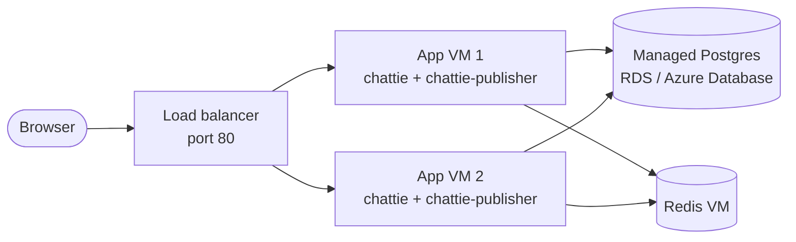

# Deploying Chattie: the complete guide

Everything from an empty GitHub account to a running distributed chat system
on AWS and Azure, and back to zero cost. Follow it top to bottom.

The terminal is used only where there is no button: Git, Docker, Terraform and
the tests. Everything you look at or change inside a cloud is done by clicking
in the [AWS console](https://console.aws.amazon.com) or the
[Azure portal](https://portal.azure.com). Commands are for Bash (Git Bash or
MSYS2 on Windows), run from the repository root unless a step says otherwise.

Contents:

1. [What you are building](#1-what-you-are-building)
2. [Install the tools](#2-install-the-tools)
3. [Put the code on GitHub and let it build](#3-put-the-code-on-github-and-let-it-build)
4. [Run it on your own machine](#4-run-it-on-your-own-machine)
5. [How Terraform works](#5-how-terraform-works)
6. [Deploy to AWS](#6-deploy-to-aws)
7. [Deploy to Azure](#7-deploy-to-azure)
8. [Experiments](#8-experiments)
9. [Deploy a new version](#9-deploy-a-new-version)
10. [Tear down](#10-tear-down)
11. [Troubleshooting](#11-troubleshooting)
12. [When you are finished for good](#12-when-you-are-finished-for-good)
13. [Reference](#13-reference)

---

## 1. What you are building



- **Load balancer.** The only thing reachable from the internet. It spreads
  browsers across the app VMs and skips any VM whose `/readyz` check fails.
- **App VMs.** Each runs two Docker containers from the same image: `chattie`
  (HTTP, WebSocket, web page) and `chattie-publisher` (forwards committed
  events from Postgres to Redis).
- **Managed Postgres.** Holds every user and message. It is a cloud service,
  not a VM: RDS on AWS, Azure Database for PostgreSQL on Azure. The cloud
  stores the data outside any VM, patches the server and takes daily backups.
  It has no public address and only accepts encrypted connections.
- **Redis VM.** Runs the `redis` container. Redis only carries live
  notifications between app VMs, so losing it loses no data.

How the image gets there:

```text
git push --> GitHub Actions: test, build image --> ghcr.io --> each app VM pulls it
```

Nothing is built on your machine. AWS and Azure are two separate copies of the
system, each with its own users and messages.

**Cost.** About 10 cents an hour on each cloud while the system is up
(approximate), paid from your credits. After `destroy` it costs
nothing.

**This is a learning setup, not production.**

- Plain HTTP, no HTTPS. Use throwaway passwords in the chat.
- `destroy` deletes the database and its backups. Nothing is kept.
- The app encrypts its database connection but does not check the server's
  certificate.
- Terraform keeps a state file on your machine that contains the generated
  passwords. It is git-ignored. Do not share it.

---

## 2. Install the tools

You need accounts on [GitHub](https://github.com), AWS and Azure, and these
tools:

```bash
winget install Git.Git
winget install Docker.DockerDesktop
winget install GoLang.Go
winget install Hashicorp.Terraform
winget install Amazon.AWSCLI
winget install Microsoft.AzureCLI
```

Skip any you already have. **Close the terminal and open a new one**, then
check that each answers:

```bash
git --version
docker --version
go version
terraform version
aws --version
az version
```

Start Docker Desktop and wait until it says it is running.

| Tool | What it is for |
| --- | --- |
| Git | Sends the code to GitHub |
| Docker Desktop | Runs the system on your machine |
| Go | Runs the tests against a running system |
| Terraform | Creates and deletes the cloud resources |
| AWS CLI, Azure CLI | Sign Terraform in to each cloud (one command each). Nothing else |

---

## 3. Put the code on GitHub and let it build

### 3.1 Create the repository

1. Open <https://github.com/new>.
2. Owner `aniruddha81`, name `chattie-cloud`, visibility **Public**.
3. Do not add a README, .gitignore or license. Click **Create repository**.

The names matter: the image is published as
`ghcr.io/aniruddha81/chattie-cloud`. If you use other names, change the image
name in three places: the `image` variable in `deploy/aws/main.tf` and
`deploy/azure/main.tf`, and the `image:` line in `deploy/local/compose.yaml`.

### 3.2 Push the code

```bash
git add .
git status
git commit -m "Chattie Cloud"
git branch -M main
git remote add origin https://github.com/aniruddha81/chattie-cloud.git
git push -u origin main
```

`git status` shows what will be committed. Make sure no `.tfstate` or
`.tfvars` file is listed. The first push opens a browser window to sign in to
GitHub.

### 3.3 Watch the build

Open the repository on GitHub and click the **Actions** tab. A run named `CI`
starts by itself. It has two jobs, defined in `.github/workflows/ci.yml`:

1. **test**: starts the whole system on GitHub's machine with Docker Compose
   and runs the integration tests against it, including one that stops Redis.
2. **image**: builds the Docker image and publishes it with two tags:
   `latest` and the first seven characters of the commit ID.

Wait for both jobs to turn green (about three minutes). Click the run to see
its summary, which shows the published image name and tag.

If a job fails, click it to read the log. The step named *Show container
logs* prints what the containers said.

### 3.4 Make the image public

A new image is private. The VMs pull it without logging in, so make it public
once:

1. Open <https://github.com/aniruddha81?tab=packages>.
2. Click `chattie-cloud`, then **Package settings** on the right.
3. At the bottom, **Change visibility**, choose **Public** and confirm.

Check that anyone can pull it:

```bash
docker logout ghcr.io
docker pull ghcr.io/aniruddha81/chattie-cloud:latest
```

It should end with `Status: Downloaded newer image`.

---

## 4. Run it on your own machine

This is free and shows you what a healthy system looks like before you pay
for one.

```bash
docker compose -f deploy/local/compose.yaml up -d
docker compose -f deploy/local/compose.yaml ps
```

All seven services should show `Up`: `proxy`, `app1`, `app2`, `app3`,
`publisher`, `postgres`, `redis`. Open <http://localhost:8080>, create two
accounts in two browser windows (use a private window for the second) and
chat. The sidebar shows which instance each window is connected to.

Run the tests against it:

```bash
go test -p 1 -vet=off -tags integration ./tests/integration/
```

Stop it, keeping the data, or stop it and delete the data:

```bash
docker compose -f deploy/local/compose.yaml down
docker compose -f deploy/local/compose.yaml down -v
```

---

## 5. How Terraform works

Terraform reads the `.tf` file in a folder, which describes what should
exist, and makes the cloud match it. There are five commands to know:

| Command | What it does |
| --- | --- |
| `terraform init` | Downloads the plugins for the cloud. Run once per folder. |
| `terraform plan` | Shows what would be created, changed or deleted. Changes nothing. |
| `terraform apply` | Shows the plan, asks for `yes`, then does it. |
| `terraform output` | Prints values such as the URL. |
| `terraform destroy` | Deletes everything this folder created. |

Terraform remembers what it created in `terraform.tfstate` inside the folder.
Do not delete that file while resources exist, or Terraform forgets them and
you have to delete them by hand in the console.

`-chdir=deploy/aws` tells Terraform which folder to work in, so you can stay
in the repository root.

---

## 6. Deploy to AWS

### 6.1 Create an access key

Terraform needs credentials to act as you.

1. Sign in to the [AWS console](https://console.aws.amazon.com) and open
   **IAM**.
2. **Users**, **Create user**. Name it `terraform`. Leave console access off.
3. **Attach policies directly**, tick `AdministratorAccess`, create the user.
4. Open the user, **Security credentials**, **Create access key**, choose
   **Command Line Interface**, confirm, create.
5. Keep the page open. It shows the access key ID and the secret access key.
   The secret is shown only once.

### 6.2 Sign in from the terminal

```bash
aws configure
```

| Prompt | Enter |
| --- | --- |
| AWS Access Key ID | the key ID from the page |
| AWS Secret Access Key | the secret from the page |
| Default region name | `ap-south-1` |
| Default output format | `json` |

The key is stored in `C:\Users\<you>\.aws\credentials`. Never put it in the
repository. If it was typed wrong, `plan` in the next step says so.

In the AWS console, set the region selector at the top right to **Asia
Pacific (Mumbai)**, which is `ap-south-1`. The console only shows resources
in the selected region, so everything this guide tells you to look at is
there.

### 6.3 Look before you create

```bash
terraform -chdir=deploy/aws init
terraform -chdir=deploy/aws plan
```

`plan` ends with `Plan: 28 to add, 0 to change, 0 to destroy.` Nothing exists
yet. Section 13 lists what each of those resources is.

### 6.4 Create it

```bash
terraform -chdir=deploy/aws apply
```

Type `yes` when asked. It takes about ten minutes, most of it waiting for the
database. It ends with:

```text
Apply complete! Resources: 28 added, 0 changed, 0 destroyed.

Outputs:

url = "http://chattie-123456789.ap-south-1.elb.amazonaws.com"
```

**From this moment credit is being spent.** Section 10 stops it.

### 6.5 Wait for the VMs, then check

Terraform is finished when the VMs exist, but each VM still has to install
Docker and pull the image, which takes about three more minutes. Until then
the load balancer answers `502` or `503`.

Save the URL in a variable and ask who is ready:

```bash
url=$(terraform -chdir=deploy/aws output -raw url)
curl -s "$url/readyz"
```

When it is up you get:

```text
{"connections":0,"instance":"ip-10-0-0-123"}
```

Ask ten times and watch the `instance` change as the load balancer alternates
between the two VMs:

```bash
for i in $(seq 10); do curl -s "$url/readyz"; echo; done
```

See what the load balancer thinks of each VM: AWS console, **EC2**, **Target
Groups** (under *Load Balancing* in the left menu), click `chattie`,
**Targets** tab. Both should say `Healthy`.

### 6.6 Use it

Open the URL in two browser windows, create two accounts and chat. Then run
the tests against the cloud:

```bash
CHATTIE_URLS="$url,$url" go test -p 1 -vet=off -tags integration -count=1 ./tests/integration/
```

### 6.7 Get a shell on a VM

AWS console, **EC2**, **Instances** lists the three VMs: `chattie-app-1`,
`chattie-app-2` and `chattie-redis`.

There is no SSH. To open a shell, select a VM, **Connect**, **Session
Manager** tab, **Connect**. A terminal opens in the browser. If the tab says
the instance is not available, wait two minutes after boot and refresh.

Commands to run in that shell:

```bash
sudo docker ps                             # the containers on this VM
sudo docker logs -f chattie                # app log (Ctrl+C to stop)
sudo docker logs -f chattie-publisher      # publisher log
sudo cat /var/log/cloud-init-output.log    # what the first-boot script did
```

The database is not on a VM, so there is nothing to log in to. Each app VM
has a helper, `chattie-psql`, that runs a query against it:

```bash
sudo chattie-psql -c "SELECT id, room_id, sequence, content FROM messages ORDER BY id DESC LIMIT 10"
sudo chattie-psql -c "SELECT count(*) FILTER (WHERE published_at IS NULL) AS pending, count(*) AS total FROM outbox"
```

The first run takes a little longer because it downloads the Postgres client.

See the database itself: AWS console, **RDS**, **Databases**, click
`chattie`. The summary shows its status and size, **Connectivity & security**
shows that it is not publicly accessible, and **Maintenance & backups** shows
the backup setting.

### 6.8 Check your credit

AWS console, **Billing and Cost Management**, **Credits**. Charges appear
with a delay of several hours.

---

## 7. Deploy to Azure

The Azure credit expires first, so do not leave this part too late.

### 7.1 Sign in

```bash
az login
```

A browser window opens to sign in. Back in the terminal it lists your
subscriptions; press Enter to keep the one shown. This is the only `az`
command in the guide.

### 7.2 Choose a region and VM sizes you are allowed to use

Student subscriptions allow only a few regions. To see them: Azure portal,
search for **Policy**, **Assignments**. Click the assignment whose name
mentions allowed regions or locations; its **Parameters** list the regions
you may use. This guide uses `centralindia` (Central India, in Pune), the
Azure region nearest to AWS Mumbai. If it is in the list, or there is no such
assignment and so no restriction, keep it. Otherwise pick a region from the
list and use its name wherever this guide says `centralindia`.

Then check that the VM size the deployment uses is offered in your region:
**Virtual machines**, **Create**, **Virtual machine**, choose the region,
then **See all sizes** and search for `B2ats_v2`. If it is greyed out, note
another small size that is not, and set it in the next step. Close the page
without creating anything.

Student subscriptions also allow only 6 vCPUs per region. The three VMs have
2 each, so the default deployment uses all of it.

The managed database can also be restricted by region. There is no quick
check for it: if `apply` later refuses to create the database in your region,
choose another allowed region (see section 11).

### 7.3 Write your settings

Azure portal, **Subscriptions**, click your subscription and copy its
**Subscription ID**. In your editor, create the file
`deploy/azure/terraform.tfvars` with these two lines, using your own ID and
region. The file is git-ignored.

```hcl
subscription_id = "00000000-0000-0000-0000-000000000000"
location        = "centralindia"
```

To use other VM sizes, add lines such as `app_size = "Standard_B2ts_v2"` or
`redis_size = "Standard_B2ts_v2"`.

### 7.4 Create it

```bash
terraform -chdir=deploy/azure init
terraform -chdir=deploy/azure plan
terraform -chdir=deploy/azure apply
```

`plan` ends with `Plan: 32 to add`. Type `yes` for `apply`. It takes about
ten minutes, most of it waiting for the database, and prints:

```text
url = "http://chattie-ab12cd.centralindia.cloudapp.azure.com"
```

**From this moment credit is being spent.**

### 7.5 Wait for the VMs, then check

As on AWS, the VMs need about three minutes to install Docker and pull the
image.

```bash
url=$(terraform -chdir=deploy/azure output -raw url)
curl -s "$url/readyz"
for i in $(seq 10); do curl -s "$url/readyz"; echo; done
```

The `instance` is `chattie-app-1` or `chattie-app-2`. To see everything
Terraform created: Azure portal, **Resource groups**, `chattie`. Click a VM
to see its status and private address.

### 7.6 Use it

Open the URL in two browser windows and chat, then run the tests:

```bash
CHATTIE_URLS="$url,$url" go test -p 1 -vet=off -tags integration -count=1 ./tests/integration/
```

### 7.7 Run commands on a VM

There is no SSH. The portal can run a command on a VM for you: **Resource
groups**, `chattie`, click a VM, **Operations**, **Run command**,
**RunShellScript**. Paste the command, click **Run**, and the output appears
below after about 30 seconds.

Commands run as root, so no `sudo`. The box is not a live terminal: a command
that keeps running, such as `docker logs -f`, never returns, so use `--tail`.

Commands to run there:

```bash
docker ps                                    # the containers on this VM
docker logs --tail 20 chattie                # app log
docker logs --tail 20 chattie-publisher      # publisher log
tail -n 30 /var/log/cloud-init-output.log    # what the first-boot script did
```

The database is not on a VM. Each app VM has a helper, `chattie-psql`, that
runs a query against it (the first run downloads the Postgres client):

```bash
chattie-psql -c "SELECT id, room_id, sequence, content FROM messages ORDER BY id DESC LIMIT 10"
```

See the database itself: in the `chattie` resource group, click the
PostgreSQL server (its name starts with `chattie-`). The overview shows its
status, version and size, and **Backup and restore** shows the backups.

### 7.8 Check your credit

Azure portal, **Subscriptions**, your subscription. The overview shows the
remaining credit and the cost so far, with a delay of several hours.

---

## 8. Experiments

This is the point of the project. Keep two browser windows open on the chat,
signed in as two users, ideally connected to different instances (the sidebar
shows which; reload a window until they differ).

Commands that a step says to run on a VM go **on that VM**. On AWS, type
them in a Session Manager shell with `sudo` in front (6.7). On Azure, paste
them into the VM's **Run command** box (7.7). The other commands (`terraform`
and the `curl` loop) run on your own machine.

### 8.1 Messages cross VMs

Send a message from each window. Both arrive, although the users are on
different VMs. The path was: VM 1 saved the message in Postgres, the
publisher announced it on Redis, VM 2 heard it and pushed it to its browser.

### 8.2 Stop a chat container

On app VM 1:

```bash
docker stop chattie
```

The window connected to that VM shows *reconnecting*, then connects to the
other VM and still has every message. Before stopping, the container told its
browsers to reconnect and waited ten seconds. On AWS, open the **Targets**
tab from 6.5 and see the VM turn `Unhealthy`. Bring it back:

```bash
docker start chattie
```

### 8.3 Stop the publishers

On **both** app VMs:

```bash
docker stop chattie-publisher
```

Send a message. The sender sees it, because it was saved in Postgres and
acknowledged. The other user does not, because nobody is forwarding events to
Redis. On an app VM, count the waiting events:

```bash
chattie-psql -c "SELECT count(*) FROM outbox WHERE published_at IS NULL"
```

Start one publisher:

```bash
docker start chattie-publisher
```

The message appears in the other window within a second or two, and the count
returns to zero. This is the outbox pattern: an event can be delayed by a
failure, but not lost.

### 8.4 Stop Redis

On the Redis VM:

```bash
docker stop redis
```

Send a few messages. They are saved and acknowledged, but not delivered live.
Then:

```bash
docker start redis
```

The other window receives a `resync` notice and fetches everything it missed
from Postgres, without reloading the page.

### 8.5 Lose a whole VM

AWS: **EC2**, **Instances**, select `chattie-app-2`, **Instance state**,
**Terminate (delete) instance**.

Azure: **Resource groups**, `chattie`, click `chattie-app-2`, **Stop**.

The chat keeps working on the remaining VM. To repair it: on AWS,
`terraform -chdir=deploy/aws apply` creates a replacement; on Azure, click
**Start** on the same VM.

### 8.6 Scale out

```bash
terraform -chdir=deploy/aws apply -var app_count=3
```

Terraform adds one VM and registers it with the load balancer. After about
three minutes, `/readyz` shows three instance names. A later `apply` without
`-var` goes back to two. To keep three, put `app_count = 3` in
`deploy/aws/terraform.tfvars`.

Do this one on AWS. On an Azure student subscription a third app VM would
need 8 vCPUs, and the limit is 6.

### 8.7 Restart the database

AWS: **RDS**, **Databases**, select `chattie`, **Actions**, **Reboot**.

Azure: **Resource groups**, `chattie`, click the PostgreSQL server,
**Restart**.

While the database is down, sending fails and both app VMs fail `/readyz`,
so the load balancer has nowhere to send traffic. Postgres is the one part
that everything depends on. Watch it come back:

```bash
for i in $(seq 30); do curl -s -o /dev/null -w "%{http_code} " "$url/readyz"; sleep 2; done
```

After a minute or so the answers return to `200` without anyone touching the
app. The chat containers and the publishers reconnect on their own.

### 8.8 Restore a backup (AWS, about 25 minutes)

A backup you have never restored is only a hope. This takes a snapshot,
restores it as a second database and checks the data is there.

Everything here is in the AWS console under **RDS**.

Take the snapshot: **Databases**, select `chattie`, **Actions**, **Take
snapshot**. Name it `chattie-test`. Open **Snapshots** and wait until its
status is `Available`.

Restore it as a new database next to the real one: **Snapshots**, select
`chattie-test`, **Actions**, **Restore snapshot**. Set these and leave the
rest alone:

| Setting | Value |
| --- | --- |
| DB instance identifier | `chattie-restored` |
| DB instance class | Burstable classes, `db.t4g.micro` |
| Virtual private cloud (VPC) | `chattie` |
| DB subnet group | `chattie` |
| Public access | No |
| Existing VPC security groups | `chattie-db` (remove `default`) |

Click **Restore DB instance** and wait until `chattie-restored` shows
`Available` under **Databases**. Click it and copy the **Endpoint** from the
**Connectivity & security** tab. On an app VM, run the same counts against
both databases and compare (put the endpoint in place of `<address>`):

```bash
sudo chattie-psql -tA -c "SELECT (SELECT count(*) FROM users), (SELECT count(*) FROM rooms), (SELECT count(*) FROM messages), (SELECT max(last_sequence) FROM rooms)"
sudo DB_HOST=<address> chattie-psql -tA -c "SELECT (SELECT count(*) FROM users), (SELECT count(*) FROM rooms), (SELECT count(*) FROM messages), (SELECT max(last_sequence) FROM rooms)"
```

The numbers match, apart from anything sent after the snapshot.

**Delete the copy and the snapshot.** Terraform did not create them, so
`destroy` cannot remove them, and they would block it and keep billing.

1. **Databases**, select `chattie-restored`, **Actions**, **Delete**. Untick
   **Create final snapshot** and **Retain automated backups**, tick the
   acknowledgement, type `delete me` and confirm. Wait until it disappears
   from the list.
2. **Snapshots**, select `chattie-test`, **Actions**, **Delete snapshot**.

---

## 9. Deploy a new version

1. Change the code, then push:

   ```bash
   git add .
   git commit -m "Describe the change"
   git push
   ```

2. Wait for the `CI` run on GitHub to turn green.
3. Find the image tag. It is the first seven characters of the commit ID:

   ```bash
   git rev-parse --short=7 HEAD
   ```

4. Apply with that tag:

   ```bash
   terraform -chdir=deploy/aws apply -var image=ghcr.io/aniruddha81/chattie-cloud:abc1234
   ```

Terraform replaces the app VMs with new ones that pull the new image. They are
replaced together, so the chat is unreachable for a few minutes. Messages are
safe in the managed database, which is not touched.

A later `apply` without `-var image=...` would go back to `latest`. To make a
version stick, put it in `terraform.tfvars`:

```hcl
image = "ghcr.io/aniruddha81/chattie-cloud:abc1234"
```

Terraform still runs from your machine. It builds nothing; it only tells the
cloud what should exist.

---

## 10. Tear down

Do this whenever you stop for the day. Bringing it back later is one `apply`.

```bash
terraform -chdir=deploy/aws destroy
terraform -chdir=deploy/azure destroy
```

Type `yes`. Everything is deleted, including the database and its backups.
It takes about ten minutes, most of it the database.

Confirm nothing is left on AWS. In the console, with the region set to
**Asia Pacific (Mumbai)**, these four pages should be empty:

- **EC2**, **Instances**. Instances marked `Terminated` are already gone and
  drop off the list within an hour.
- **EC2**, **Load Balancers**.
- **RDS**, **Databases**.
- **RDS**, **Snapshots**, **Manual** tab.

Confirm nothing is left on Azure: in the portal, **Resource groups** no
longer lists `chattie`. Azure may keep a group named `NetworkWatcherRG`. It
is created by Azure itself and costs nothing.

Look at the billing page of each cloud the next day to confirm the cost
stopped growing.

**About the credits.** Left running all day, this system would use the AWS
credit in about 80 days and the Azure credit in about 37. Neither cloud
charges a card when credit runs out: AWS closes a free-plan account and Azure
disables the subscription. Destroy when you are not using it and the credits
will easily outlast your learning.

---

## 11. Troubleshooting

| What you see | Likely cause and fix |
| --- | --- |
| `terraform`, `aws` or `az`: command not found | Open a new terminal after installing. In MSYS2, the Windows `PATH` is only visible if the shell was started with `-use-full-path` (or `MSYS2_PATH_TYPE=inherit`). |
| `git push` is rejected | The GitHub repository was created with a README. Create it empty, or run `git pull --rebase origin main` first. |
| The `CI` run fails in *Integration and failure tests* | Read the *Show container logs* step. Run the same tests locally (section 4) to reproduce. |
| The `image` job fails with `denied` | Usually a package named `chattie-cloud` already exists under your account from another repository. Delete it under **Packages**, then re-run the job. |
| `502` or `503` for more than six minutes after `apply` | The first-boot script failed. Read `/var/log/cloud-init-output.log` on an app VM (6.7 or 7.7). |
| That log ends with `docker pull` and `denied` or `unauthorized` | The image is still private. Do 3.4, then replace the VMs (see below). |
| That log ends with `manifest unknown` | The image tag does not exist. Check the tag in the Actions run summary. |
| `/readyz` says `postgres unavailable` | The database is restarting or not ready yet. Check its status on its console page (end of 6.7 or 7.7). |
| AWS: `backup retention period exceeds the maximum available to free tier customers` | Your account may not keep backups. Apply with `-var backup_days=0`. Experiment 8.8 still works, because it takes its own snapshot. |
| AWS: `destroy` fails on the subnet group or security group | A restored database from experiment 8.8 still exists. Do the two delete steps at the end of 8.8, then `destroy` again. |
| Azure: the database fails with a message that the location or subscription is restricted | The database service is not offered to your subscription in that region. Change `location` to another allowed region, run `destroy`, then `apply`. |
| AWS: `VcpuLimitExceeded` | Your account allows fewer VMs. Use `-var app_count=1`. |
| AWS: `InvalidClientTokenId` or `AuthFailure` | The access key is wrong. Run `aws configure` again. |
| Azure: `RequestDisallowedByAzure` or `not allowed by policy` | The region is not allowed for your subscription. Change `location` (7.2). |
| Azure: `SkuNotAvailable` | The VM size is not offered there. Set `app_size` or `redis_size` (7.3). |
| Azure: `QuotaExceeded` on `Total Regional Cores` | The VMs need more vCPUs than your subscription allows in that region (6 for students). Use `-var app_count=1`, or delete other VMs in that region. |
| Azure: `apply` is slow the first time | Terraform is registering resource providers on a new subscription. Let it finish. |
| `Error acquiring the state lock` | A previous Terraform run was interrupted. Run `terraform -chdir=<folder> force-unlock <ID>` with the ID from the message. |
| Session Manager lists no instances | The VM's agent needs two minutes after boot. Refresh. |

To replace the app VMs after fixing something (for example after making the
image public), force Terraform to recreate them:

```bash
terraform -chdir=deploy/aws apply -replace="aws_instance.app[0]" -replace="aws_instance.app[1]"
terraform -chdir=deploy/azure apply -replace="azurerm_linux_virtual_machine.app[0]" -replace="azurerm_linux_virtual_machine.app[1]"
```

If a `destroy` fails halfway, run it again. It continues where it stopped.

---

## 12. When you are finished for good

1. Destroy both clouds and confirm, as in section 10.
2. Delete the AWS access key: IAM, **Users**, `terraform`, **Security
   credentials**, delete the key. Then remove it from your machine:

   ```bash
   rm "$(cygpath "$USERPROFILE")/.aws/credentials"
   ```

3. Sign out of Azure:

   ```bash
   az logout
   ```

4. Stop the local stack and delete its data:

   ```bash
   docker compose -f deploy/local/compose.yaml down -v
   ```

---

## 13. Reference

### What Terraform creates on AWS (`deploy/aws/main.tf`)

| Resource | Purpose |
| --- | --- |
| VPC, internet gateway, 2 public subnets, route table | A private network in two zones with a way out to the internet |
| 2 private subnets, DB subnet group | Where the database lives. They have no route to the internet |
| 4 security groups | Firewalls. Load balancer: port 80 from anyone. App: 8080 from the load balancer only. Database: 5432 from the app VMs only. Redis: 6379 from the app VMs only |
| IAM role and instance profile | Lets you open a Session Manager shell on the VMs |
| 2 random passwords | The database password and the secret that signs login cookies |
| RDS database (`db.t4g.micro`, 20 GB) | Managed Postgres: encrypted storage, daily backups, no public address |
| 1 Redis VM (`t3.micro`) | Redis container |
| 2 app VMs (`t3.micro`) | `chattie` and `chattie-publisher` containers |
| Load balancer, target group, listener | Receives port 80 and forwards to healthy app VMs on 8080 |

### What Terraform creates on Azure (`deploy/azure/main.tf`)

| Resource | Purpose |
| --- | --- |
| Resource group | A folder that holds everything, so it can be deleted together |
| Virtual network, VM subnet | The private network |
| Database subnet, private DNS zone and link | A subnet reserved for the database, and a private name so the VMs can find it |
| Network security group | Firewall. Only port 8080 is open to the internet; Redis is reachable only inside the network |
| Public IP with a DNS name | The address of the load balancer |
| Load balancer, 2 pools, probe, rule, outbound rule | Forwards port 80 to healthy app VMs on 8080, and gives the VMs a way out to the internet |
| 3 network interfaces | One per VM. The Redis VM has the fixed address `10.1.0.10` |
| 2 random passwords, 1 key | Database password, cookie secret, and the login key Azure requires (port 22 is never opened) |
| PostgreSQL Flexible Server (`B_Standard_B1ms`, 32 GB) and its database | Managed Postgres: seven days of backups, no public address |
| 1 Redis VM (`Standard_B2ats_v2`) | Redis container |
| 2 app VMs (`Standard_B2ats_v2`) | `chattie` and `chattie-publisher` containers |

### What a VM does on first boot (`deploy/vm`)

- `app.sh.tftpl`: installs Docker, pulls the image, writes the settings to
  `/etc/chattie.env`, starts the two containers with `--restart always`, and
  installs the `chattie-psql` helper.
- `redis.sh`: installs Docker and starts Redis.

Terraform fills in the image name, addresses and passwords before sending the
app script to the VM.

### Settings you can change

| Variable | Default | Where |
| --- | --- | --- |
| `image` | `ghcr.io/aniruddha81/chattie-cloud:latest` | both |
| `app_count` | `2` | both |
| `region` | `ap-south-1` | AWS |
| `backup_days` | `1` | AWS |
| `subscription_id` | none, required | Azure |
| `location` | `centralindia` | Azure |
| `app_size`, `redis_size` | `Standard_B2ats_v2` | Azure |
| `db_size` | `B_Standard_B1ms` | Azure |

Set them with `-var name=value` for one run, or in `terraform.tfvars` inside
the folder to keep them.

### Command summary

```bash
# local
docker compose -f deploy/local/compose.yaml up -d
docker compose -f deploy/local/compose.yaml down

# AWS
terraform -chdir=deploy/aws init
terraform -chdir=deploy/aws apply
terraform -chdir=deploy/aws output -raw url
terraform -chdir=deploy/aws destroy

# Azure
terraform -chdir=deploy/azure init
terraform -chdir=deploy/azure apply
terraform -chdir=deploy/azure output -raw url
terraform -chdir=deploy/azure destroy

# tests against any running system
CHATTIE_URLS="$url,$url" go test -p 1 -vet=off -tags integration -count=1 ./tests/integration/
```
